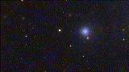
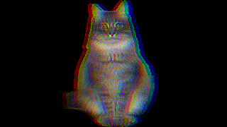
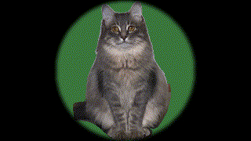

# Synthesaurio Custom TD components

This is a repository for a set of custom [touchdesigner](https://derivative.ca) components used for composition and live performance

The components are organized in 3 directories: gen, fx and utility

# gen

These componentes are generators of images. 

## blueSky

Simulation of a cloudy blue sky using noise

## space fields

Simulation of a space field background

# fx

These components are visual efffects which require an image input

## RGB Shift

## Noise filter

## Circle Filter

# utility

These are a mix of other components that serve as utilities